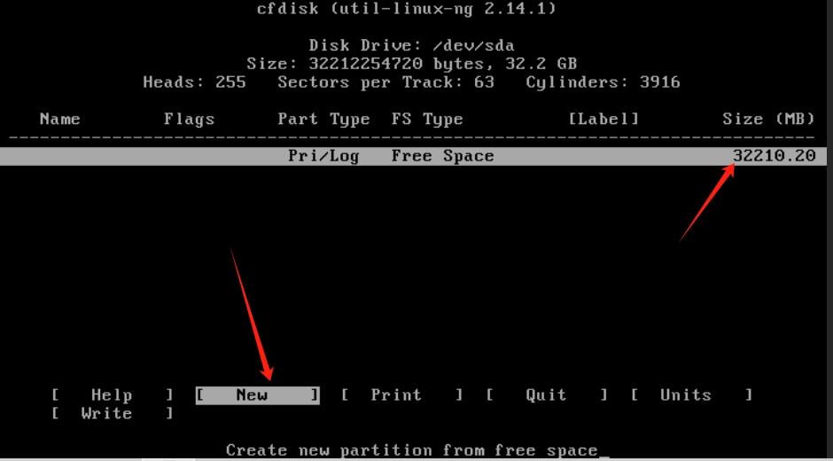
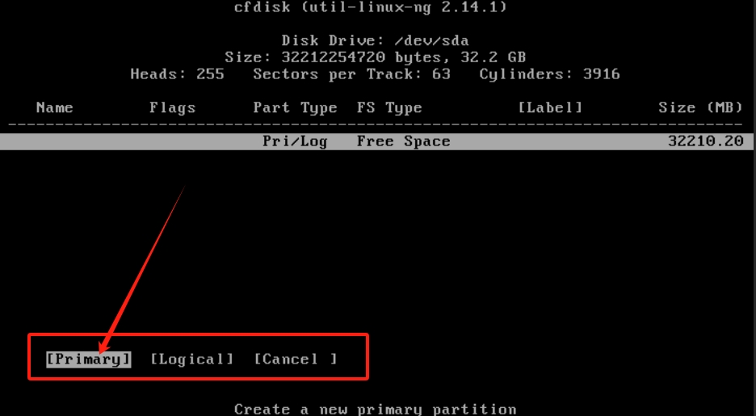
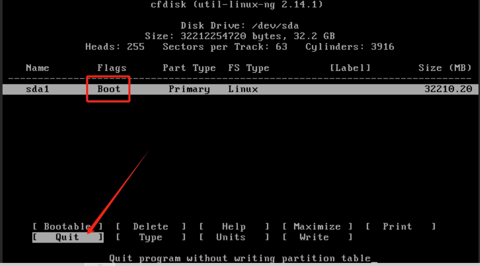
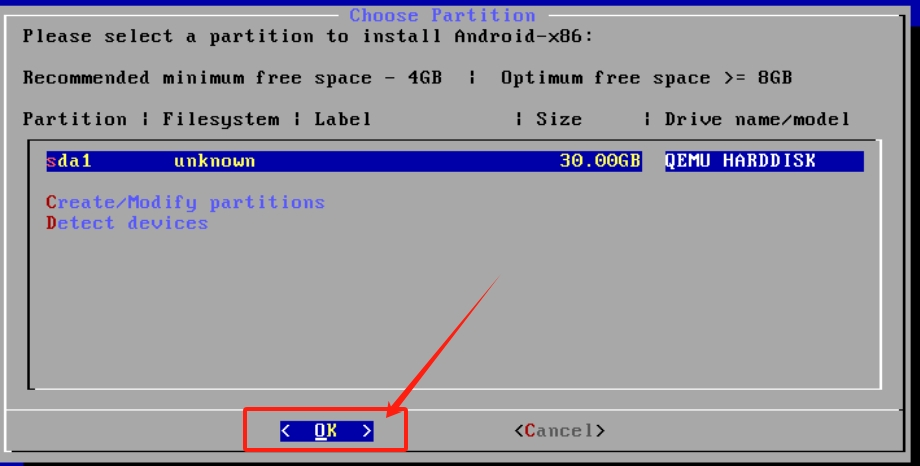
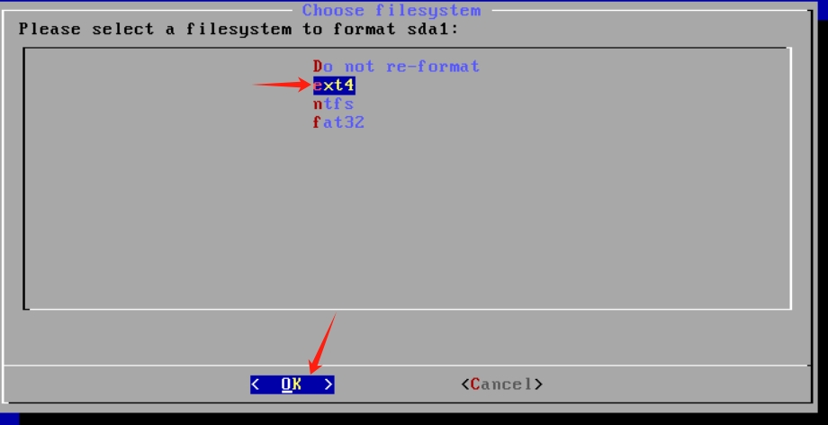
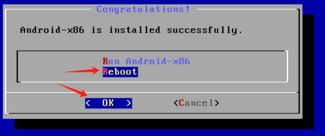
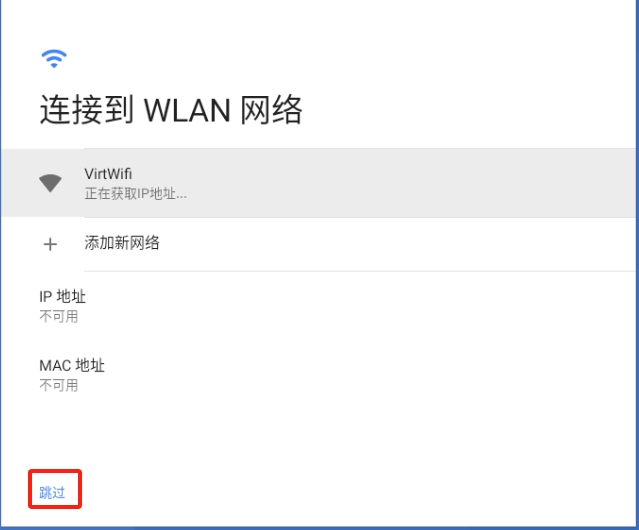
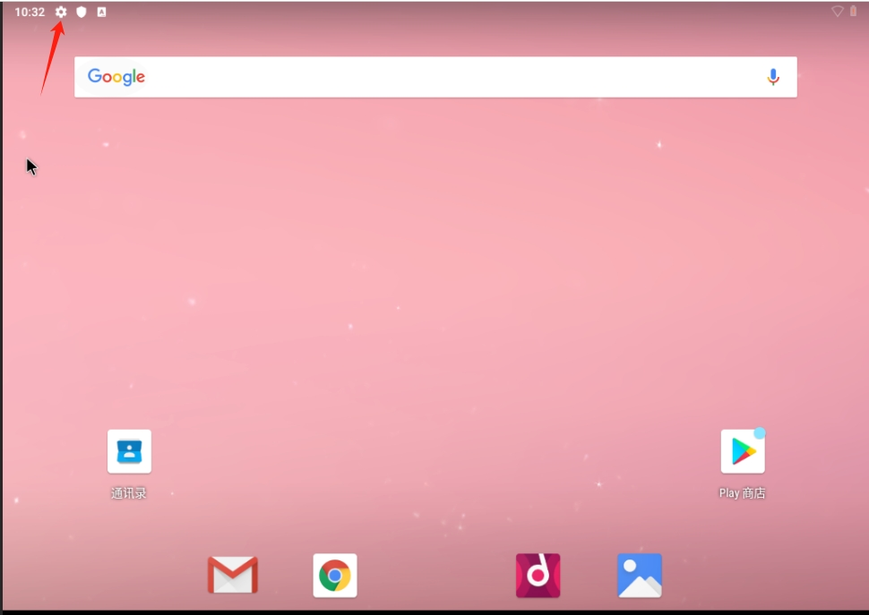
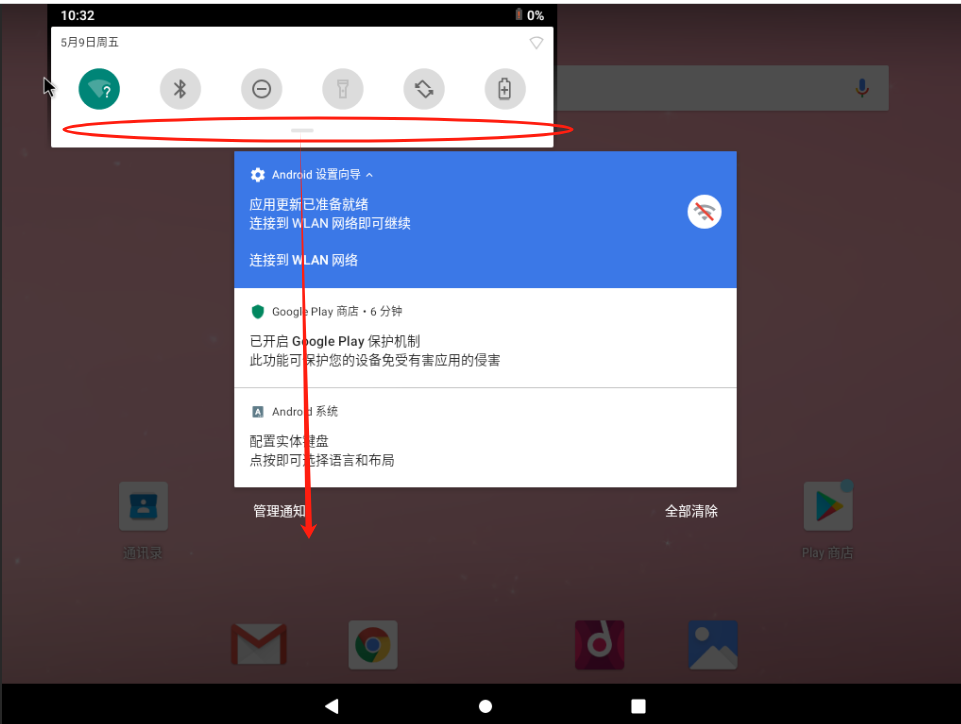
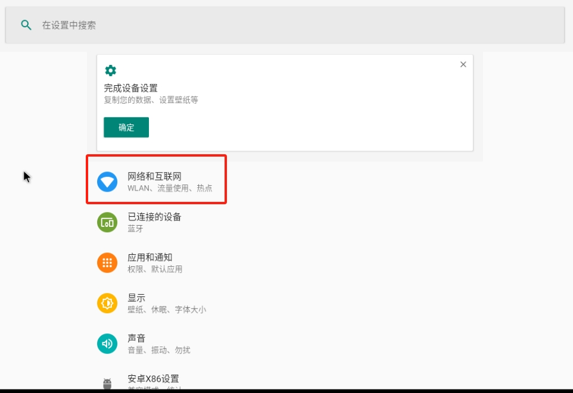

# Android Virtual Machine

## Android System Image Download

Android system version 9 and earlier image download links:

International

https://www.fosshub.com/Android-x86.html

https://sourceforge.net/projects/android-x86/files/

China

https://mirrors.tuna.tsinghua.edu.cn/osdn/android-x86/

Android system version 10 and later new image download links:

https://blissos.org/index.html#download

## Visual Machine Setup

### Setting up Android Virtual Machine with Android Version 9 and Earlier Images

This guide demonstrates using

https://mirrors.tuna.tsinghua.edu.cn/osdn/android-x86/71931/android-x86_64-9.0-rc2.iso

as an example

#### Template Setup

Create a virtual machine with VMID `100` and select the corresponding storage disk

  

Select the Android image, then choose `Linux` for `Type` and select the option containing version 2.6 for `Version`

  

Select `Vmware compatible` for `Graphic card`, other options as shown in the default image

  

Select `SATA` for disk format, allocate disk size as needed (recommended at least 30G)

  

Select `host` for CPU type. If your host machine doesn't support nested virtualization, please select `qemu64`, although success is not guaranteed in this case

  

Allocate at least 4G of memory, enter at least `4096`

  

Select `vmbr1` for bridge binding, choose `VirtIO (paravirtualized)` for `Model`, and uncheck the `Firewall` option

  

After clicking the continue button, the template is successfully created. You need to manually click start and enter the VNC interface

  

#### System Init

After entering the boot screen, select the option starting with `Installation`

  

Next, you need to create and write to the disk. If you can't select it, press the 'c' key on the keyboard to select it

  

Choose not to use GPT format

  

When the blank disk is displayed, select `New`

  

Select partition type `Primary`

  

You'll be prompted to allocate space, just press Enter to use all available space

  

Then select `Flags`, move to `Bootable`, press Enter until `Boot` is displayed under `Flags`

  

Then move to `Write` and press Enter to write

  

You'll be asked to confirm, type `yes` and press Enter to continue

  

After a progress bar completes, you'll return to the initial menu. Select `Quit` to exit the menu, and everything is now ready

  

Then you'll return to the UI interface. Use the previously initialized disk, select the `OK` button and press Enter

  

Use the arrow keys to select `ext4` for the file system, then select the `OK` button and press Enter

  

Confirm formatting, select the `OK` button and press Enter

  

Confirm GRUB boot installation, select the `OK` button and press Enter

  

Confirm the file system is readable and writable, select the `OK` button and press Enter

  

After a progress bar runs for a while, it will show installation succeeded. Select `Reboot`, then the `OK` button and press Enter

  

After a while, you'll enter the Android logo screen

  

Then it will go into a black screen. If it remains black after 3-5 minutes, execute `qm stop 100` on the host machine, then begin removing the image file

Remove the ISO file that has been installed by manually clicking on the corresponding `CD` in the `Hardware` section of the ProxmoxVE web interface and selecting `Remove`

  

Then execute `qm start 100` on the host machine, and you should enter the Android system initialization interface

Select your language in the initialization interface, then click the confirm button

  

At this point it will try to connect to WIFI. Since this PVE installation uses completely static network configuration, skip this step and configure it later

  

Click the next button to confirm time settings

  

Click to cancel screen protection, confirm to skip again

  

After a period of black screen, the main screen application selection will appear. If this interface still doesn't appear after waiting 3-5 minutes, restart the virtual machine as before, and it should display when you enter VNC again

Select `Quickstep`

#### Network configuration

Then you'll enter the desktop. Now you need to set up the network. Click the settings icon in the upper left corner

  

A dropdown appears, click and hold to pull down

  

Click the gear button

  

Enter `Network & Internet` settings

  

Double-click `WIFI` with the left mouse button

  

Modify the detected `VirtWIFI`, right-click to bring up the selection box, then click `Modify network`

  

Advanced options appear, click to open hidden options

  

Configure the network settings as shown

IP address `172.16.1.xxx` (replace xxx with your desired IP; my vmid is 100, so I used 100 for convenience)

Subnet mask `24`

Default gateway `172.16.1.1`

DNS `8.8.8.8` or `144.144.144.144`

Then click the save button

  

At this point, the settings may still not be applied. Turn off WIFI and then enable it again, it should show connected

  

Then exit to the main interface, click on Google Chrome, and try to open a webpage

  

You can see that opening this guide's URL works fine, proving the network is connected

### Setting up Android Virtual Machine with Android Version 10 and Later Images

This guide demonstrates using

as an example
