# Setting Up MacOS Virtual Machine

## Prerequisites

System and hardware configuration requirements --> Environment detection

You can only set up a MacOS virtual machine when the environment detection confirms that the host machine supports KVM nested virtualization. Otherwise, it will be detected by hardware and cannot be set up.

## Setting Up the Prerequisites

- Automatically identify CPU type (AMD or Intel) and set nested virtualization parameters according to the type.
- Modify GRUB boot parameters to enable IOMMU and disable default framebuffer.
- Add VFIO module support for hardware device passthrough.
- Blacklist sound card and graphics card driver modules to avoid conflicts with macOS.
- Configure KVM-related kernel parameters, ignore MSR errors, and improve compatibility.
- Patch Proxmox frontend status detection logic to bypass status restrictions.

```shell
curl -L https://raw.githubusercontent.com/oneclickvirt/pve/main/extra_scripts/configure_macos.sh -o configure_macos.sh && chmod +x configure_macos.sh && bash configure_macos.sh
```

After successful execution, it will show that the system will restart in 15 seconds. This is the normal process, as kernel parameters cannot take effect without restarting.

## System Image Download

- All images have pre-installed components and are relatively large (minimum about 4.9GB). Download and extraction tasks will run in the background.
- Images are complete systems with all components and can be booted and used without internet connection.
- If the free space on the system disk is less than twice the size of the image, the download will be rejected.
- Images are in 7z compressed format and need to be extracted before use.
- You can check the status of current download and extraction tasks at any time. Virtual machines can only be created after completion.

```shell
curl -L https://raw.githubusercontent.com/oneclickvirt/pve/main/scripts/install_macos_images.sh -o install_macos_images.sh && chmod +x install_macos_images.sh && bash install_macos_images.sh
```

Or

```shell
bash install_macos_images.sh
```

After the background download task starts, you can close the SSH window and wait for 30 minutes to 3 hours (depending on your server bandwidth and connectivity) to download the ISO 7z compressed package.

When the download task is complete and the current download task query shows empty, you can choose to execute the extraction task. The waiting time for extraction depends on your server's CPU performance.

When the extraction task is complete and the current extraction task query shows empty, all preparations are ready.

Tasks of the same type can run concurrently, and any task can be canceled at any time by entering the PID value.

Build from https://github.com/oneclickvirt/macos currently supported image compressed packages:

```
# Listed by system release date from old to new
high-sierra.iso.7z (Size: 5.23GB)
mojave.iso.7z (Size: 6.03GB)
catalina.iso.7z (Size: 8.33GB)
big‑sur.iso.7z (Size: 12.21GB)
monterey.iso.7z (Size: 12.36GB)
ventura.iso.7z (Size: 12.31GB)
sonoma.iso.7z (Size: 14.41GB)
sequoia.iso.7z (Size: 15.02GB)
```

## MACOS Virtual Machine Template Setup

- `big‑sur` and newer MACOS systems require at least 6 cores, 6GB memory, and 50GB disk space to set up. Newer system versions (later download sequence numbers) require more hardware resources.
- All images are boot disk images without any personal data, so disk allocation, login information setup, and network settings need to be manually configured according to the instructions.
- You need to manually start the virtual machine from the web interface. Before starting, you can check if all templates meet your expectations.

### Download Template Script

```shell
curl -L https://raw.githubusercontent.com/oneclickvirt/pve/main/scripts/build_macos_vm.sh -o build_macos_vm.sh && chmod +x build_macos_vm.sh
```

### Parameter Meanings

```shell
# ./build_macos_vm.sh VMID CPU_cores Memory Disk SSH_port VNC_port System Storage_disk Independent_IPV6(default_N_if_empty)
```

:::tip
The disk size here is only the size of the virtual machine's disk. During the actual setup process, the program will also mount the boot disk and system image, so the actual disk requirement for setting up a virtual machine is virtual machine disk size + image size + boot disk size (500MB). Always be aware of whether your disk space is sufficient for setting up virtual machines.
:::

### Example Command

Using the oldest version (high-sierra) as an example, the supported configuration is as follows (very laggy)

```shell
./build_macos_vm.sh 100 2 4096 45 44022 45901 high-sierra local N
```

After the template is set up, you can run `cat vm100` to view information, or check the NOTES in the corresponding VM in the WEB interface.

Here is the information for the example VM:

| Property             | Value         |
|----------------------|---------------|
| VMID                 | 100           |
| CPU cores            | 2             |
| Memory size          | 4096MB        |
| Disk size            | 45G           |
| SSH port             | 44022         |
| VNC port             | 45901         |
| System               | high-sierra   |
| Host storage disk    | local         |
| Independent IPV6     | N             |

:::tip
Note that VMID can only use numbers from 100 to 256, other numbers are not available
:::

## MACOS System Boot and Installation

After completing the previous steps, you can see a gray virtual machine waiting to be started in the panel.


After clicking start, enter the VNC panel. The selection box on the left has a full-screen button. It is recommended to operate in full screen to avoid resolution issues.


After about 3 minutes of boot disk loading, a startup disk will be displayed on the left center of the screen. Click directly or press Enter.

After another 3-5 minutes of startup disk loading, four selection boxes will appear. Select `Disk Utility` and click to enter.

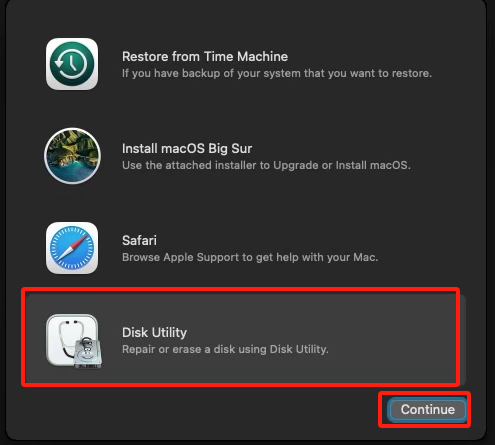

After entering, you can see three disks and one image. Find the disk larger than 40G named `QEMU HARDDISK Media`, and click `Erase`.

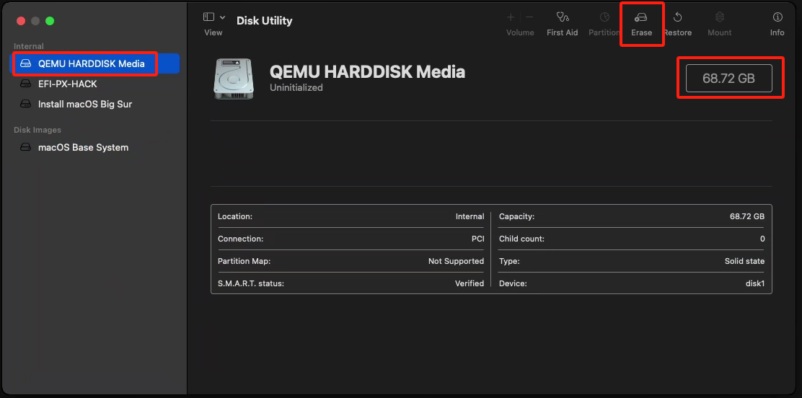  

A pop-up window will appear, requiring you to rename the `name` to `macos` for easy identification and use later, then click `Erase` to continue initialization.

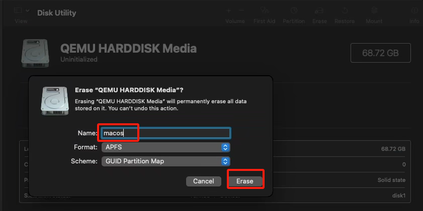  

After initialization is complete, click `Done`.

  

Now you need to exit the `Disk Utility` interface. Click `Disk Utility` in the upper right corner and select `Quit Disk Utility` to exit the current selection box.

  

Then you return to the previous four selection boxes. Select `Install macOS XXXX` (since I am using Big Sur as an example, XXXX is Big Sur), and click `continue`.

  

In the following steps, continue clicking `continue`, then click `Agree`, and then `Agree` again.

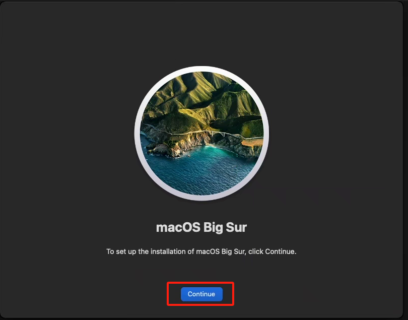

  

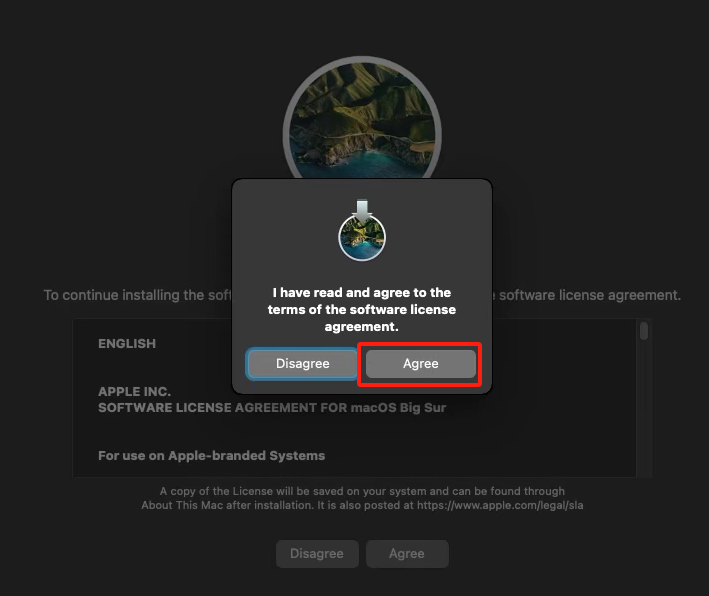  

Until those three disks appear again, but here you can see the disk larger than 40G named `macos`. Select it and click `continue`.

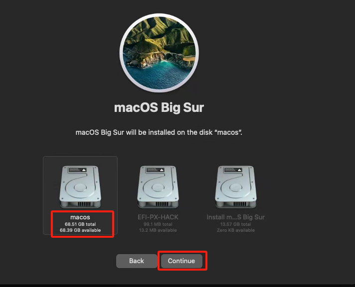  

After a period of file copying and disk loading (about 12 minutes), you will formally enter the system installation phase. Choose your region based on where the host machine is located.

  

After selecting the region, continue clicking `continue`.

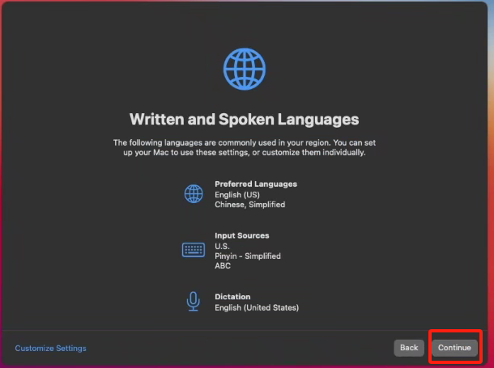  

  

Until the `Migration Assistant` data migration option appears, select `Not Now` in the lower left corner to not import user data.

  

Then you will be prompted to create a user. Fill in the username, account name, and login password. After setting up, click `continue`.

  

After that, you will continue clicking `continue` until the system installation is complete.

## Network Configuration

Since the system installation was performed in an offline environment, you need to manually configure a static network connection to the host's bridge.

Click the WIFI button in the upper right corner, turn off WIFI, and then click `Network Preferences ...`

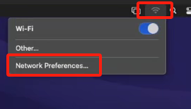  

After entering the settings interface, click the `Advanced` button to enter the advanced settings interface.

  

Fill in the static network configuration in the `TCP/IP` tab.

Configure IPV4: `Manually`

IPV4 Address: `172.16.1.xxx` (replace xxx with the IP you want to bind, my vmid is 100, so I wrote 100 for convenience)

Subnet Mask: `255.255.255.0`

Router: `172.16.1.1`

If you need to configure an IPV6 network, similar to the IPV4 settings above, you will need to fill in the public IPV6 address bound to the virtual machine (written in the Note box in the PVE panel), subnet mask 128, and the default gateway obtained by executing `cat /usr/local/bin/pve_check_ipv6` on the host.

  

Fill in the static network DNS configuration in the `DNS` tab.

Generally, adding `8.8.8.8` and `1.1.1.1` is sufficient. For use in mainland China, use `114.114.114.114`.

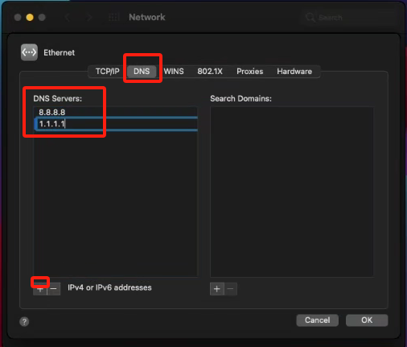  

After filling in and applying, the top left of the settings will show that the network is connected.

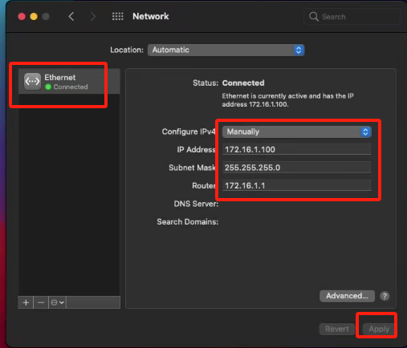  

Now, opening the default browser and visiting any website will allow you to access public network resources, proving that the network has worked.

## Remove ISO

Manually click on the corresponding ```CD``` in the ```Hardware``` on the web side of ProxmoxVE and select ```Remove```, then restart the VM and you can use it directly.

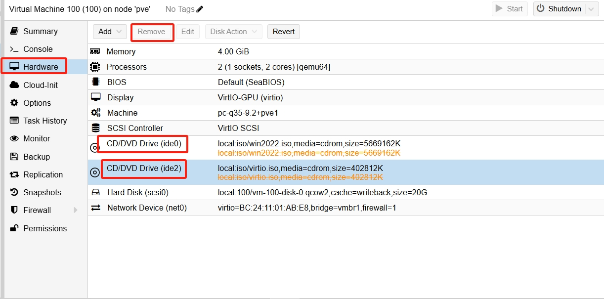

Macos system is to uninstall ```opencore.iso``` and ```xxxx (the system image used for installation).iso```, similar to the Windows system uninstallation of win image and virtio image in the example picture above.


