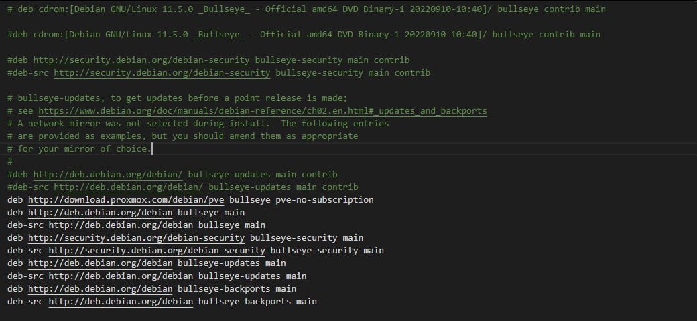
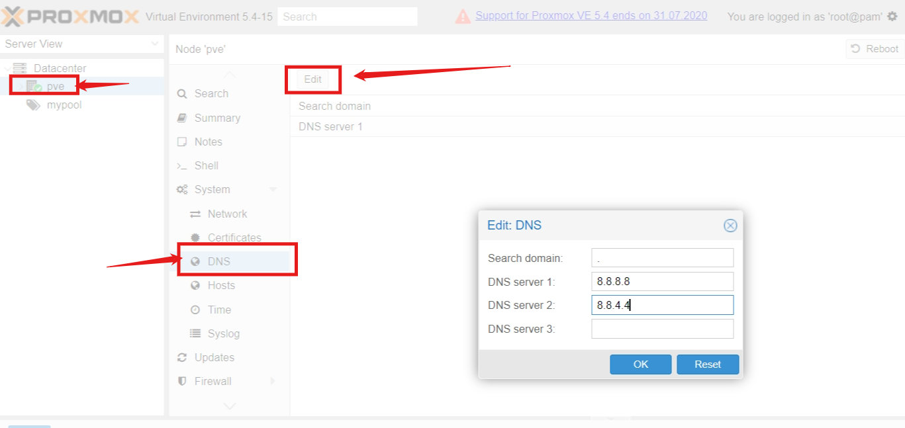

# Solve the puzzle

## Within 30 seconds of executing the script, the machine dropped.

Original system execution

```
systemctl restart networking
```

See if it is not directly offline, if so that is the machine native problem, hot plug or dhcp caused by the network can not restart, it is recommended to replace the host system or DD a new system to try!

Generally speaking, this situation occurs in the exclusive service Debian11 system, switch to Debian12 system will not be a problem!

## Installation of PVE fails with an error saying that some packages do not exist.

Execute the following command to query the source of apt

```shell
grep -r "deb " /etc/apt/sources.list /etc/apt/sources.list.d/
```

If you see

```
deb file://
deb cdrom:[
```

A line starting like this proves that the host is using local sources instead of network sources, and you need to replace the sources in ```/etc/apt/sources.list``` with a line such as



Replace the network source with the same to install using the PVE one-click install script.

Replacing the network source can be done using the following command for apt source replacement

```
bash <(curl -sSL https://raw.githubusercontent.com/SuperManito/LinuxMirrors/main/ChangeMirrors.sh) --abroad
```

## Successful PVE Installation but Lost Connection After Reboot

If the machine successfully installs PVE and the web interface is accessible, but loses connection after a reboot, please execute the following commands after a successful PVE installation and before rebooting:

```bash
auto_interface=$(grep '^auto ' /etc/network/interfaces | grep -v '^auto lo' | awk '{print $2}' | head -n 1)
if ! grep -q "^post-up /sbin/ethtool" /etc/network/interfaces; then
    chattr -i /etc/network/interfaces
    echo "post-up /sbin/ethtool -K $auto_interface tx off rx off" >> /etc/network/interfaces
    chattr +i /etc/network/interfaces
fi
```

Then report the rebooted disconnected machine to [@spiritlhl_bot](https://t.me/spiritlhl_bot) for the script to be updated and repaired automatically.

## Successful PVE Installation but can not resolve host after reboot

Common in low version of Debian system (cloud server) after installing PVE reboot no matter what URL to visit the report error

```
curl: (6) Could not resolve host:
```

View the file at this time

```
cat /etc/resolv.conf
```

Statements beginning with ```nameserver``` may be found to be absent.

You need to set up DNS on this web page



After setting up the DNS, check the file again and you will find the following content

```
search .
nameserver 8.8.8.8
nameserver 8.8.4.4
```

At this point, requesting any URL again will resolve it successfully

## PVE Installation Failed

If you encounter any issues with installing on certain machines, and if you're in a hurry, you can try using the scripts from the following repository to reinstall as Debian 11 first.

```
bash <(curl -sSL https://raw.githubusercontent.com/leitbogioro/Tools/master/Linux_reinstall/InstallNET.sh) -debian 12 -pwd 'oneclickvirt139' --network "static"
```

The system username after dd at this point is ```root```, and the password is ```oneclickvirt139```.

If it doesn't work, check the issues and descriptions in https://github.com/leitbogioro/Tools A common problem is that the machine is raid0 not raid10, and you need to add a parameter to specify the value of the raid.

If you have time or if it's still not working, please contact [@spiritlhl_bot](https://t.me/spiritlhl_bot) for assistance.

## What to do if you open centos7 and find that CGroupV1 is not supported?

Enable CGroup V1: To enable CGroup V1 on an Ubuntu system, you need to edit the kernel boot parameters.

Please note that before changing kernel boot parameters, make sure to backup important data and settings to prevent unexpected problems.

Edit the ```/etc/default/grub`` file and add ``systemd.unified_cgroup_hierarchy=0`` to the end of the parameters in ``GRUB_CMDLINE_LINUX_DEFAULT``, just like:

```
GRUB_CMDLINE_LINUX_DEFAULT="quiet splash systemd.unified_cgroup_hierarchy=0"
```

Save the file and run the following command to update the GRUB boot.

```bash
sudo update-grub
```

Reboot the system for the changes to take effect

If the above changes still do not support the opening of centos7, try using a different host system.

## What to do if you accidentally delete a NAT mapping rule

Use the following command to map back

```shell
iptables -t nat -F
iptables -t filter -F
service networking restart
systemctl restart networking.service
cat /etc/iptables/rules.v4 | iptables-restore
```

## Verified VPS Providers

### VPS Providers Offering KVM Virtualization with NAT

[spartanhost](https://billing.spartanhost.net/aff.php?aff=1705) Debian12 on a Dedicated Server (Debian11 has problems)

[interserver](https://www.interserver.net/r/802990) VPS or dedicated servers

[frantech](https://my.frantech.ca/aff.php?aff=5522) Las Vegas Tier 2

[eugamehost](https://www.eugamehost.com/clients/aff.php?aff=194) US Phoenix Black Friday Special

[amhost](http://amhost.net/vps/?cid=29317) Testing version

[digitalocean](https://m.do.co/c/e9712622ee89) Perminu Intel and Regular 4-core versions

[skrime](https://skrime.eu/a/server) Lowest configuration of AMD Ryzen KVM Server

[webdock](https://webdock.io/en?maff=wdaff--150) AMD KVM Server

[4vps](https://clck.ru/33VQmc) Russian and Greek testing versions

[adtaq](https://www.adtaq.com/) Storage KVM server with lowest configuration

[nocix](https://www.nocix.net/) Dedicated servers

[online.net](https://www.scaleway.com/en/dedibox/) Debian12 on a Dedicated Server (Debian11 has problems)

[OVH](https://www.ovhcloud.com/en/public-cloud/) Public Cloud needs to be installed after dd as a pure system using the following command

```shell
bash <(curl -sSL https://raw.githubusercontent.com/leitbogioro/Tools/master/Linux_reinstall/InstallNET.sh) -debian 12 -pwd ' oneclickvirt139' --network "static"
```

At this point, the system username after dd is ``root``, and the password is ``oneclickvirt139``. If it doesn't work, check the issues and descriptions in https://github.com/leitbogioro/Tools A common problem is that the machine is raid0 not raid10, and you need to add a parameter to specify the value of the raid.

### VPS Providers Offering NAT with LXC Virtualization

[Tencent Cloud](https://curl.qcloud.com/tPrMnfZm) Worry-Free and Student editions

[spectraip](https://my.spectraip.net/aff.php?aff=35) KVM servers

[Linode](https://www.linode.com/lp/refer/?r=9296554d01ecacaa0be56892fd969b557722becd) Lowest configuration with dedicated CPU

[hosthatch](https://cloud.hosthatch.com/a/2450) Special high-configuration servers

[hetzner](https://hetzner.cloud/?ref=CnWVr0FGneUl) Cloud servers

[rackdog](https://cloud.rackdog.com/referral/bx8fms) Servers with floating IP

[vultr](https://www.vultr.com/?ref=9124520-8H) Standard Cloud servers

[azure](https://portal.azure.com/#create/Microsoft.VirtualMachine-ARM) Standard machines

[scaleway](https://www.scaleway.com/en/) ARM architecture servers

[aws](https://aws.amazon.com/lightsail/) EC2 servers

[Google cloud platform - GCP](https://console.cloud.google.com/) AMD servers
