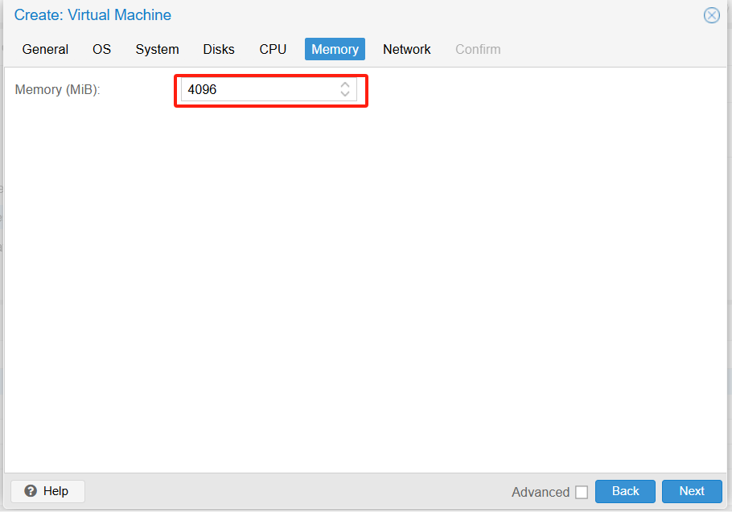
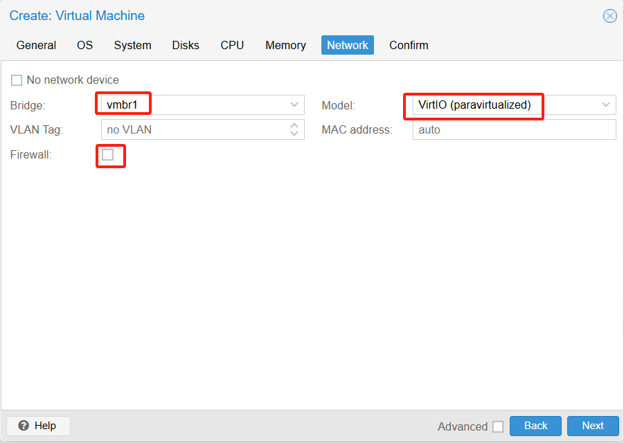
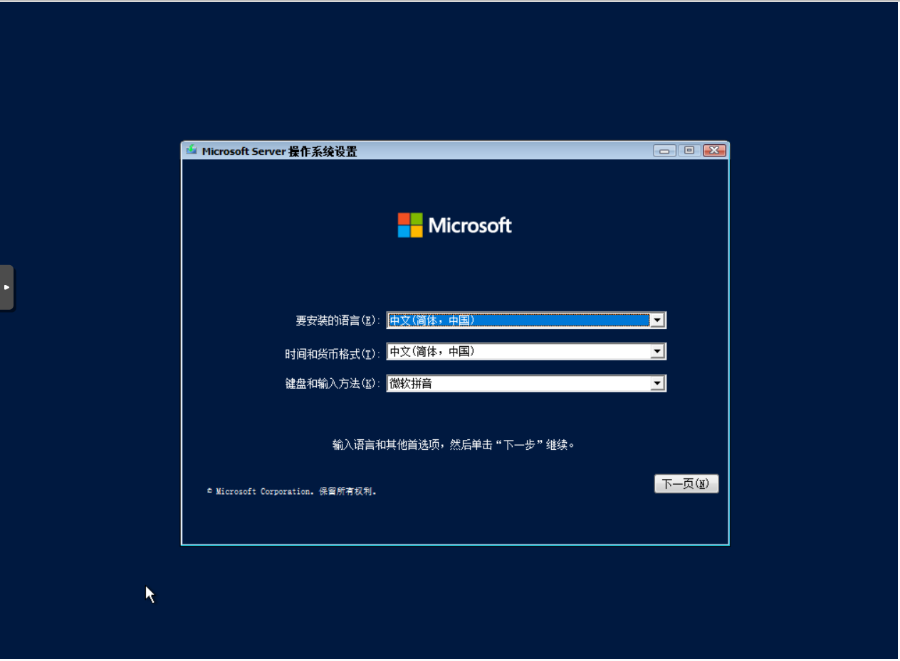
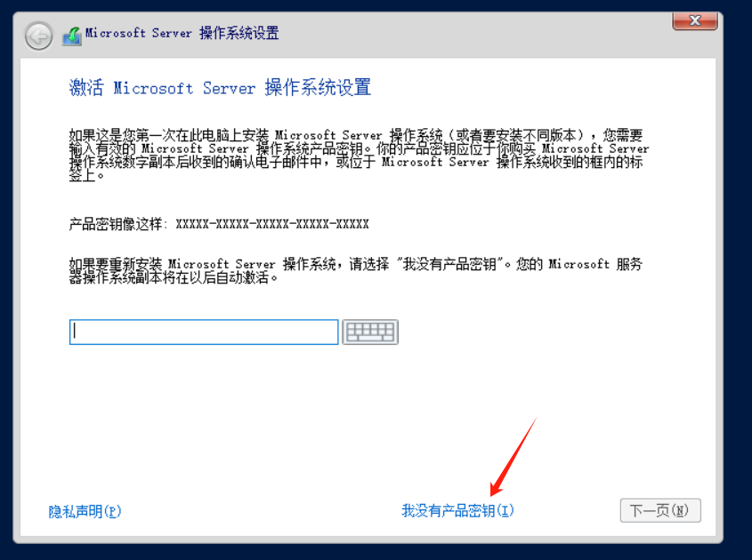
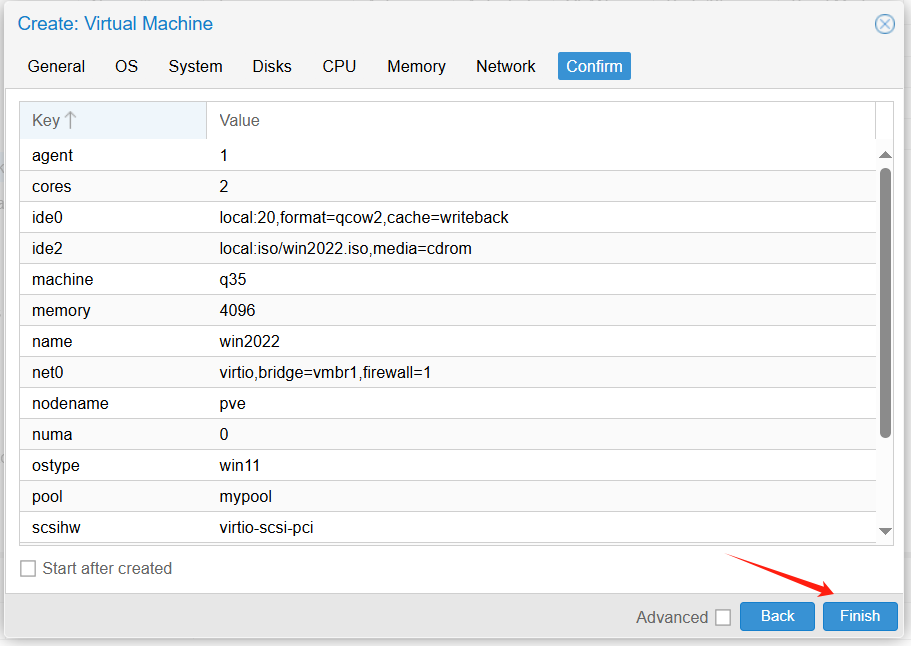
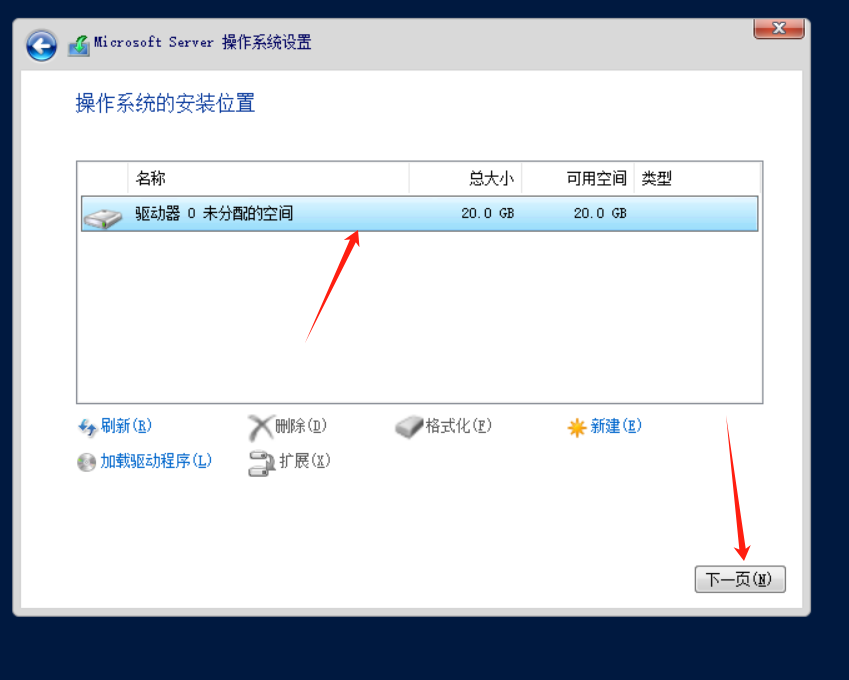
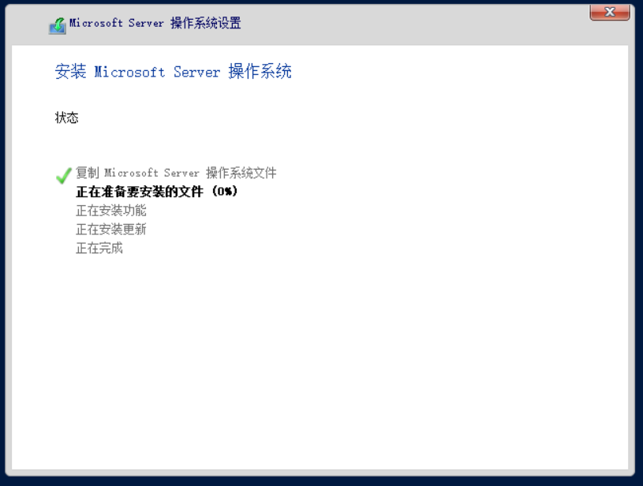
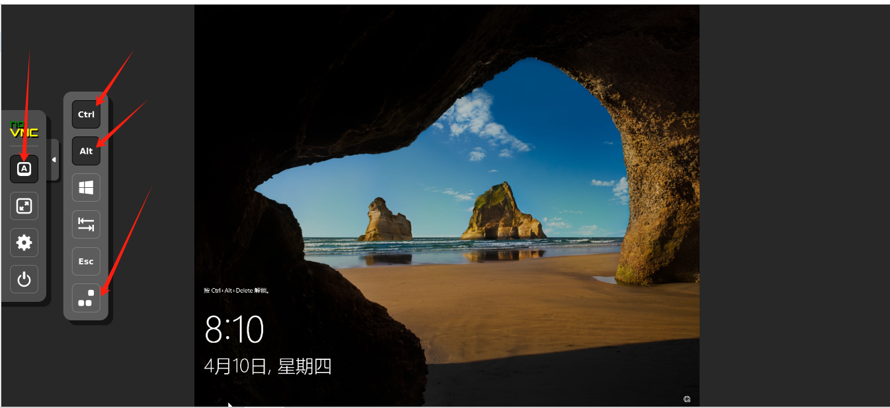
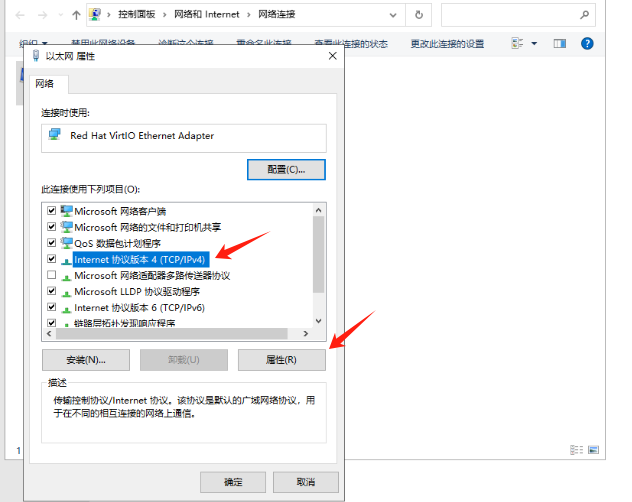

## Using ISO Image with VirtIO for VM Setup

### 1. Download the Image
Before installation, you need to download the image file via `local(pve) --> ISO images --> Download from URL`

For the download link (`URL:`), you can use files from:
https://github.com/ILLKX/Windows-VirtIO

Enter `win.iso` as the `File Name:`


Click `Download`. After downloading is complete, you can see the file size of `win.iso` on the current page, confirming it's in ISO format.


### 2. Setting Up the Template
Click `Create VM` in the top right corner of the page.

In the `General` window, select `mypool` for `Resource Pool:`, enter `win` for `Name`, then click `Next`.


In the `OS` window, select `win.iso` for `ISO image`. For `Guest OS`, select `Microsoft Windows` as the `Type` and choose the appropriate `Version` for your ISO. For example, if you downloaded Windows 2022, select `11/2022`, then click `Next`.


In the `System` window, select `VirtIO-GPU` for `Graphic card`, `q35` for `Machine`, `VirtIO SCSI` for `SCSI Controller`, and `Default (SeaBIOS)` for `BIOS`, then click `Next`.


In the `Disk` window, select `Write Back` for `Cache`, enter your desired disk size in `Disk size (GiB)` (generally not less than `20`), and choose the storage location in `Storage`. In this example, only the system disk `local` is available, so `local` is selected. Then click `Next`.


In the `CPU` window, enter the number of cores needed in `Cores`, then click `Next`.


In the `Memory` window, enter the desired memory size in `Memory (MiB)`, then click `Next`.


In the `Network` window, select `vmbr1` for `Bridge`, `VirtIO (paravirtualized)` for `Model`, uncheck `Firewall`, then click `Next`.


In the `Confirm` window, click `Finish`.


### 3. Graphical Installation Configuration
Click on the template you've set up on the left, click `Start` in the upper right corner to start the virtual machine, then click `Console` to enter the `VNC` interface and wait for the operating system to boot.


In the VNC, click `Next`, then `Install now`, then `I don't have a product key`, check `Accept license`, click `Next`, and then select `Custom installation`.






If the image comes with VirtIO drivers, you should be able to see the available system storage disk and its size. Select it and click `Next`.



Wait for the system to install. It may restart automatically several times and could take more than 10 minutes.


After installation is complete, you'll be asked to set a password during first login.


Once setup is complete, there's a pop-up box on the left side of the NOVNC page. Click the first button, then follow the login prompt by pressing `Ctrl`+`Alt`+last button to enter the login page.

### 4. Network Initialization
Since the PVE is set up with a static network through this project, you need to manually modify the bound IP address after logging in, rather than using DHCP.

Right-click in the bottom right corner of the desktop and select `Open Network and Internet settings`. In the settings page that appears, click `Change adapter options`.


In the `Network Connections`, select `Ethernet` and click `Change settings of this connection`.


In the popup window, select `Internet Protocol Version 4 (TCP/IPv4)` and click `Properties`.


In the new dialog box, select `Use the following IP address` and enter:
IP address(I): `172.16.1.xxx` (replace xxx with your desired IP, I used 100 for convenience as my vmid is 100)
Subnet mask(U): `255.255.255.0`
Default gateway(D): `172.16.1.1`

Then select `Use the following DNS server addresses` and enter:
```
8.8.8.8
144.144.144.144
```

Click OK in the bottom right corner, and make sure `Validate settings upon exit` is NOT checked.


Click `OK` and `Yes` for any other dialog boxes, and your virtual machine will now have network connectivity.