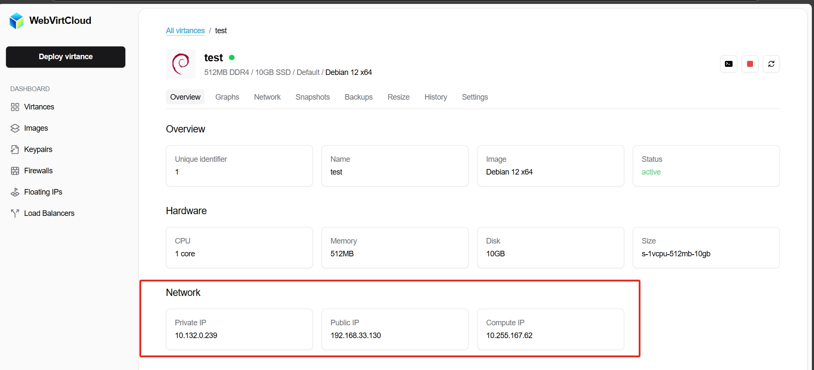

## WebVirtCloud Installation Guide

[](https://hits.spiritlhl.net)

Repository: <https://github.com/oneclickvirt/webvirtcloud>

## Controller Installation

### System Requirements

**Minimum Configuration:**

- CPU: 1 core
- Memory: 1 GB RAM
- Disk: 10 GB free space

### Default Login Information

- Username: `admin@webvirt.cloud`
- Password: `admin`

### Access URLs

- Client Panel: `https://192-168-0-114.nip.io`
- Admin Panel: `https://192-168-0-114.nip.io/admin`

> **Note:** Replace `192.168.0.114` with your actual public IP address to get the correct access URL.

### Installation Command

```bash
curl -slk https://raw.githubusercontent.com/oneclickvirt/webvirtcloud/main/scripts/install_webvirt_cloud.sh -o install_webvirt_cloud.sh \
&& chmod +x install_webvirt_cloud.sh \
&& bash install_webvirt_cloud.sh
```

## Hypervisor Installation

> **Important:** The Hypervisor and Controller cannot be installed on the same virtual machine; network conflicts will occur.

### System Requirements

**Recommended Configuration:**

- CPU: 2 cores
- Memory: 4 GB RAM
- Disk: 40 GB free space

> **Additional Notes:**
>
> - Higher specifications are recommended for production use. This minimal setup is only sufficient to run 4 small VMs in a test environment.
> - The server must support KVM nested virtualization with VM-x/AMD-V/Hyper-V enabled.
> - The installation uses binary files directly, skipping dependency installation.

### Environment Testing

To test if your server supports KVM nested virtualization:

```bash
curl -L https://cdn.spiritlhl.net/https://raw.githubusercontent.com/oneclickvirt/ecs/master/goecs.sh -o goecs.sh && chmod +x goecs.sh && ./goecs.sh install
```

### Hypervisor Installation Steps

1. Download the installation script:

   ```bash
   curl -slk https://raw.githubusercontent.com/oneclickvirt/webvirtcloud/main/scripts/install_hypervisor.sh -o install_hypervisor.sh \
   && chmod +x install_hypervisor.sh
   ```

2. Run the installation (replace with your Controller IP):

   ```bash
   bash install_hypervisor.sh x.x.x.x
   ```

   > Replace `x.x.x.x` with your Controller's actual IP address.

3. Panel node
   After the execution is completed, there will be a prompt that needs to be filled in the Controller panel side of the content.
   Panel side to fill in the Hostname is the IPV4 address of the current computing node, as well as to fill in the Token to identify the node.

### NetworkManager Version Issue

You might see this error during installation:

```
Connection 'eth0' (bed050e9-ff49-4665-8112-24ddf2a1cd3c) successfully deleted.
Warning: nmcli (1.48.10) and NetworkManager (1.42.2) versions don't match. Restarting NetworkManager is advised.
Error: Failed to add 'br-ext' connection: connection.autoconnect-ports: unknown property
```

**Solution:** Reboot your server, then run the installation command again.

### Installation Time Notes

- The entire process takes approximately **20-25 minutes**.
- Most time is spent downloading `finnix-125.iso` to `/var/lib/libvirt/isos/finnix-125.iso`.
- This download cannot be accelerated; use `tmux` or `screen` to prevent interruption.

### Adding Compute Node to Controller Panel

After installation, a **Token** will be generated for adding the compute node to the Controller:

Path: `Admin Panel > Computers > Add`

### Add Public IPV4 Ports Mapping for the Created Virtual Machine

Assume your virtual machine appears in the user control panel as:



And the result of executing `ip a | head -n 15` on the host machine is:

```shell
1: lo: <LOOPBACK,UP,LOWER_UP> mtu 65536 qdisc noqueue state UNKNOWN group default qlen 1000
    link/loopback 00:00:00:00:00:00 brd 00:00:00:00:00:00
    inet 127.0.0.1/8 scope host lo
       valid_lft forever preferred_lft forever
    inet6 ::1/128 scope host
       valid_lft forever preferred_lft forever
2: ens3: <BROADCAST,MULTICAST,UP,LOWER_UP> mtu 1500 qdisc fq_codel state UP group default qlen 1000
    link/ether 52:54:00:f1:d6:8b brd ff:ff:ff:ff:ff:ff
    altname enp0s3
    inet your-public-IPV4-address/associated-subnet-mask scope global noprefixroute ens3
       valid_lft forever preferred_lft forever
    inet6 2a0b:4140:4c60::2/48 scope global noprefixroute
       valid_lft forever preferred_lft forever
    inet6 fe80::5054:ff:fef1:d68b/64 scope link noprefixroute
       valid_lft forever preferred_lft forever
```

It can be seen that the public IPV4 address is bound to the `ens3` interface, so the following commands will use `ens3`.

To map port 22 of the current virtual machine to port 3322 of the public IPV4 address, run:

```shell
# Add a DNAT rule: forward traffic from public port 3322 to local 192.168.33.130:22
iptables -t nat -A PREROUTING -i ens3 -p tcp --dport 3322 -j DNAT --to-destination 192.168.33.130:22
# Add a POSTROUTING rule: enable NAT masquerading for proper return traffic
iptables -t nat -A POSTROUTING -p tcp -d 192.168.33.130 --dport 22 -j MASQUERADE
# Allow incoming traffic on port 3322 (required if firewalld is enabled)
iptables -I INPUT -p tcp --dport 3322 -j ACCEPT
```

Now the internal virtual machine is exposed to the internet and can be accessed remotely.

## Troubleshooting

### Troubleshooting Adding Compute Node

On the Controller node, execute:

```shell
telnet <node ip> 8884
```

On the compute node, execute:

```shell
systemctl status webvirtcompute
```

```shell
systemctl status libvirtd
```

```shell
systemctl status prometheus
```

```shell
systemctl status prometheus-libvirt-exporter
```

If none of the above reveals the issue, then on the Controller node, execute:

```shell
docker exec -it webvirtcloud-backend /bin/sh
```

```shell
vi webvirtcloud/settings/production.py
```

Change `DEBUG=False` to `DEBUG=True`.

After saving the file, execute inside the container:

```shell
UV_PROJECT_ENVIRONMENT=/usr/local uv sync --dev
```

Then `exit` the container and execute:

```shell
docker restart webvirtcloud-backend
sleep 3
docker logs webvirtcloud-backend -f
```

Then trigger the error from the frontend; the log will now display the corresponding error in real time.

### Docker containers do not restart themselves after a Controller reboot

If Docker containers don't auto-restart after a system reboot, run:

```bash
docker start $(docker ps -a -q)
```

## Disadvantages

The VM image is written to death, there is no way to use your own custom image, and there is no way to export it, and the original image does not have password login and ROOT login available.

## Thanks

https://webvirt.cloud/
