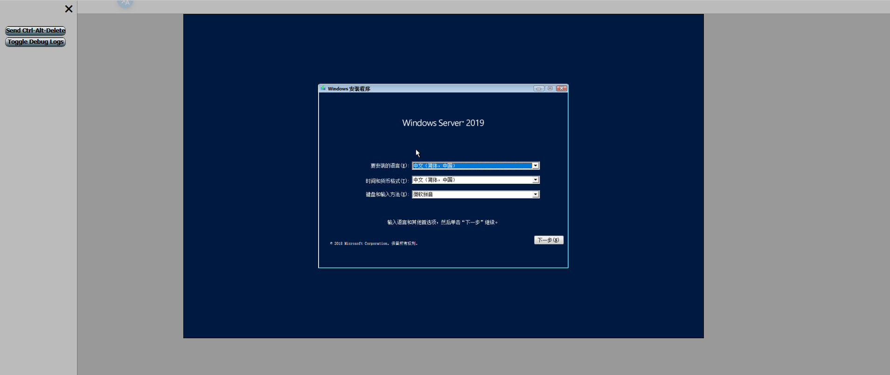
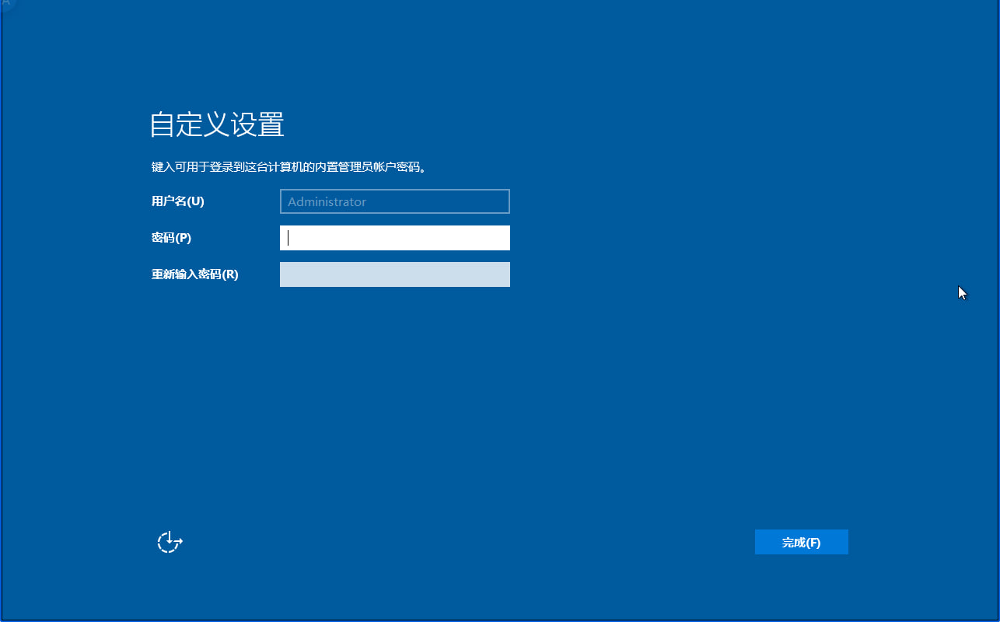
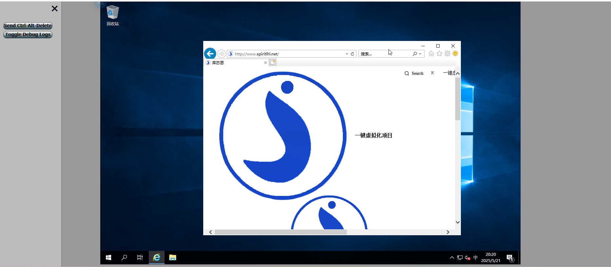

# 在 LXD 中运行 Windows 虚拟机

## 检查 lxd 驱动

确保```lxc info```输出中含有```qemu```，否则无法创建VM：

```shell
lxc info | grep -i driver:
```

若显示只有```lxc```，则lxd的驱动不支持开设虚拟机，不需要看后续的教程了。

## 准备环境和修补镜像

在```/root```目录下按顺序执行以下命令：

```shell
apt update
apt install -y snapd libguestfs-tools wimtools rsync libhivex-bin libwin-hivex-perl genisoimage || apt install -y mkisofs
snap install lxd-imagebuilder --classic --edge
# 重启加载一些配置
reboot
```

下载镜像并进行修补，如果你使用的是别的镜像，自行替换下载链接(不需要下载自带virtio的镜像，原始的镜像就够了)

自行下载Windows镜像的地址：https://down.idc.wiki/ISOS/Windows/

下面的指南将以windows2019作为示例进行

```shell
wget https://down.idc.wiki/ISOS/Windows/Server%202019/cn_windows_server_2019_updated_july_2020_x64_dvd_2c9b67da.iso -O win.iso
lxd-imagebuilder repack-windows \
  --windows-arch=amd64 \
  win.iso \
  win.lxd.iso
```

修补时长取决于程序何时添加完毕启动所需的驱动(未完毕时会一个个添加)。

有的耗时短有的耗时长，最长可能超过10~30分钟，建议在screen或tmux中挂起执行

修补完毕后可删除原始的镜像：

```shell
rm -f win.iso
```

## 创建虚拟机并挂载安装ISO

这里我使用的配置是3核5G内存30G硬盘，如果使用的是windows10等更新版本的镜像，至少需要4核6G内存40G硬盘。

建议使用比我现在设置的资源更多的CPU和内存(主要是内存)，避免系统卡到崩溃。

如果内存不够用，建议查看本指南的其他实用项目中的添加SWAP项目，自行添加更多虚拟内存。

```shell
lxc init winvm --vm --empty
lxc config device override winvm root size=30GiB
lxc config set winvm limits.cpu=3 limits.memory=5GiB
lxc config device add winvm vtpm tpm path=/dev/tpm0
lxc config device add winvm install disk source=/root/win.lxd.iso boot.priority=10
```

## 启动虚拟机并通过浏览器远程访问桌面

安装浏览器访问所需组件

```shell
apt update
apt install -y spice-html5 websockify lsof
```

启动虚拟机

```shell
lxc start winvm
```

无问题后启动远程访问的组件

```shell
SERVER_IP=$(hostname -I | awk '{print $1}')
nohup websockify --web /usr/share/spice-html5 6080 \
         --unix-target=/var/snap/lxd/common/lxd/logs/winvm/qemu.spice \
         > /var/log/websockify-winvm.log 2>&1 &
echo "SPICE HTML5 console on http://${SERVER_IP}:6080/spice_auto.html"
```

浏览器打开输出提示的地址

首次启动需要按浏览器页面左上角的```Ctrl+Alt+Delete```按钮，重启后在默认的界面按照提示，按回车等待5~10分钟才会正式装载ISO进行实际的安装

最终会显示三个立方体的图标，这个图标在这里转圈圈需要至少2分钟，请耐心等待。


转圈圈完毕就会进入正常的Win虚拟机安装流程，类比PVE的操作即可。




如果已经安装完成(执行到蓝屏，鼠标卡住不能动了，等待超过5分钟)，先关闭/退出Windows(在浏览器上关机)，然后移除 ISO 设备，保证下次从硬盘启动

```shell
lxc stop winvm
lxc config device remove winvm install
lxc start winvm
```

启动后可见如下图






无需自行进行网络配置，lxd将自动分配IPV4地址和连接网络

## 删除远程组件重新启动浏览器映射

如果发现资源没给够等原因需要删虚拟机重新开设，那么需要使用```pkill -f websockify```终止所有的spice信号转发，然后```lxc delete -f winvm```强行删除虚拟机。

```shell
lsof -i :6080
```

查询对应端口的PID号是否还存在，确保已完全停止(如果你有多个虚拟机的信号转发，那么最好不要用```pkill```删除所有，用```kill -9```删除对应端口的PID即可)。

## 如果首次启动没过几分钟就崩溃停机了

需要添加CPU直通

```shell
lxc config set winvm raw.qemu -- "-cpu host"
```

再次启动虚拟机即可

## 缺点

前端无权限校验，没法设置用户密码

如果需要前端鉴权，那么得使用```Guacamole```添加一些设置来实现，这里就不赘述了

虚拟机这块没有成型的一些交互面板和适配，```spice```太[古老](https://docs.redhat.com/zh-cn/documentation/red_hat_enterprise_linux/9/html/considerations_in_adopting_rhel_9/ref_changes-to-spice_assembly_virtualization)了(虽然有网页端的spice客户端)，官方的面板又不支持rbac使用用户名密码，只能通过证书使用
