## 开设时选择KVM虚拟化还是QEMU的TCG仿真

宿主机本身如果支持嵌套虚拟化，那么就可用```host```或```kvm64```或```qemu64```类型的CPU

从性能上来说，```host``` > ```kvm64``` > ```qemu64```

```qemu```类型虚拟化性能损耗很多

如果本身不支持嵌套虚拟化，那么只能用```qemu64```类型的CPU，且需要在启动虚拟机前修改```Options[选项]```中的```KVM hardware virtualization[KVM硬件虚拟化]```

设置为```no```取消```Enabled[启用]```的勾选

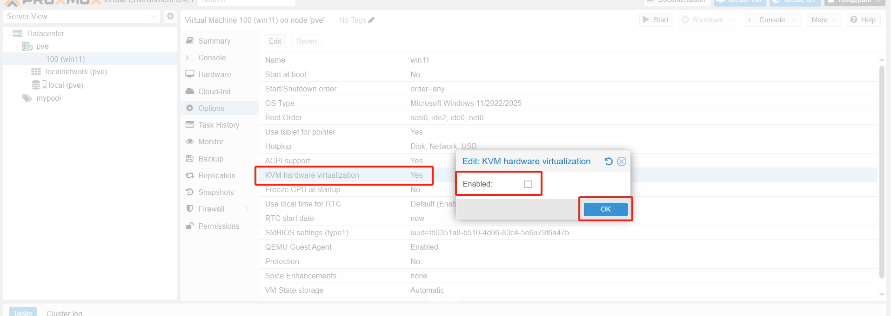

如果你实在不清楚本机是否支持嵌套虚拟化，那么

借鉴

<https://cdn.spiritlhl.net/https://raw.githubusercontent.com/oneclickvirt/pve/main/scripts/check_kernal.sh>

这块的逻辑，主要检测

```egrep -c '(vmx|svm)' /proc/cpuinfo``` 检测是否为1

```cat /sys/module/kvm_intel/parameters/nested```是否存在且为1

```lsmod | grep -q kvm```检测是否已加载

这些都支持的时候，才可选```host```类型

## 使用带virtio的iso镜像文件开设

### 1.下载镜像

安装需要提前下载镜像文件```local(pve) --> ISO images --> Download from URL```

下载链接```URL:```可使用

<https://github.com/ILLKX/Windows-VirtIO>

中的文件链接，文件名字```File Name:```填```win.iso```


点击下载```Download```，下载完成后当前的页面可见```win.iso```的文件大小，可见格式为iso。

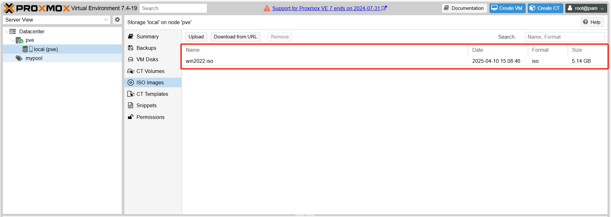

### 2.设置模板

页面顶部右上角点击```Create VM```

```General```窗口中，```Resource Pool:```勾选```mypool```，```Name```填写```win```，然后点击```Next```。

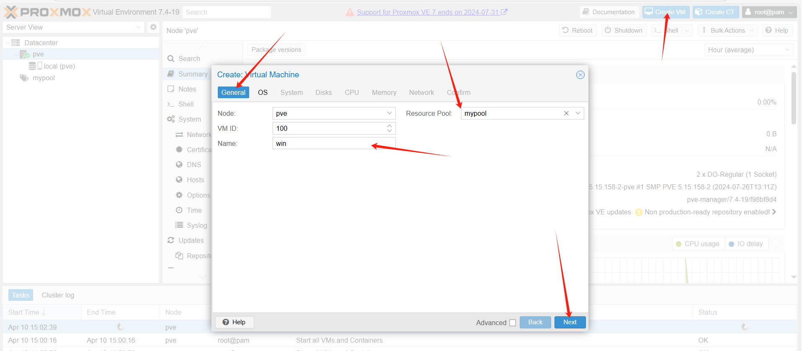

```OS```窗口中，```ISO image```勾选```win.iso```，```Guest OS```勾选```Type```为```Microsoft Windows```类型，```Version```选择当前```ISO```的```win的版本```，示例下载是```2022```，就选```11/2022```类型，然后点击```Next```。

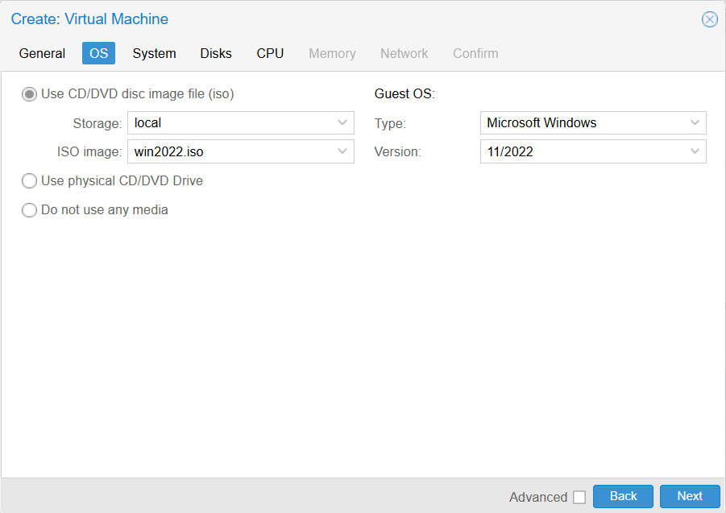

```System```窗口中，```Graphic card```勾选```VirtIO-GPU```类型，```Machine```勾选```q35```类型，```SCSI Controller```勾选```VirtIO SCSI```类型，```BIOS```勾选```Default (SeaBIOS)```类型，然后点击```Next```。


```Disk```窗口中，```Cache```勾选```Write Back```类型，```Disk size (GiB)```填写你要分配的硬盘大小，一般不小于```20```，```Storage```选择存储在哪个盘，示例只有系统盘```local```所以就选```loacl```，然后点击```Next```。

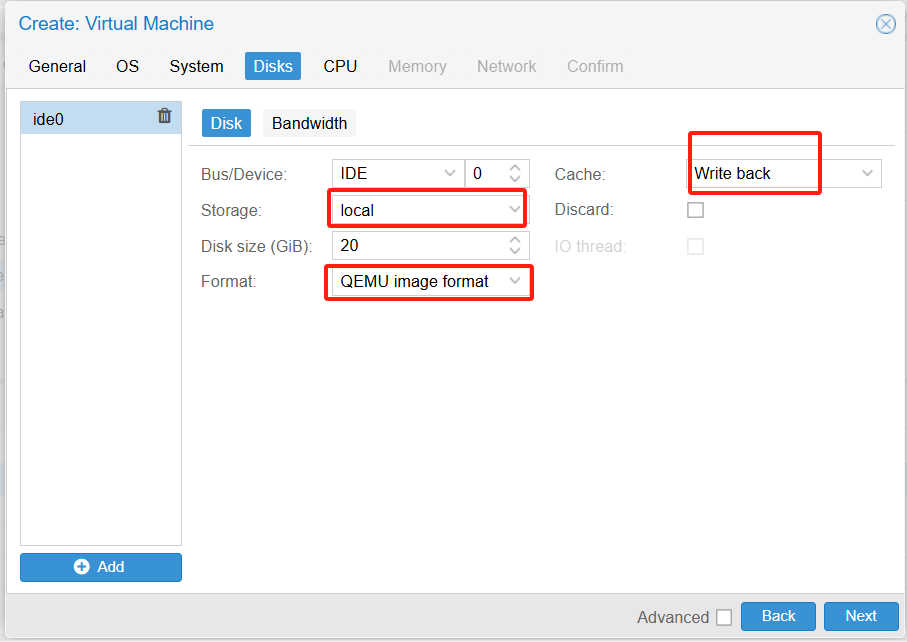

```CPU```窗口中，```Cores```填写所需核数，CPU类型按照前面描述的方法选择，然后点击```Next```。


```Memory```窗口中，```Memory (MiB)```填写所需内存大小，然后点击```Next```。


```Network```窗口中，```Bridge```勾选```vmbr1```类型，```Model```勾选```VirtIO (paravirtualized)```类型，```Firewall```取消勾选，然后点击```Next```。


```Confirm```窗口中，点击```Finish```。


### 3.图形化配置安装

左侧点击设置好的模板，右上角点击```Start```启动虚拟机，然后点击```Console```进入```VNC```界面，等待操作系统启动。


然后在VNC中点击```下一页```，然后点击```现在安装```，然后点击```我没有产品密钥```，然后勾选```接受许可```，点击```下一页```，然后勾选```自定义安装```。

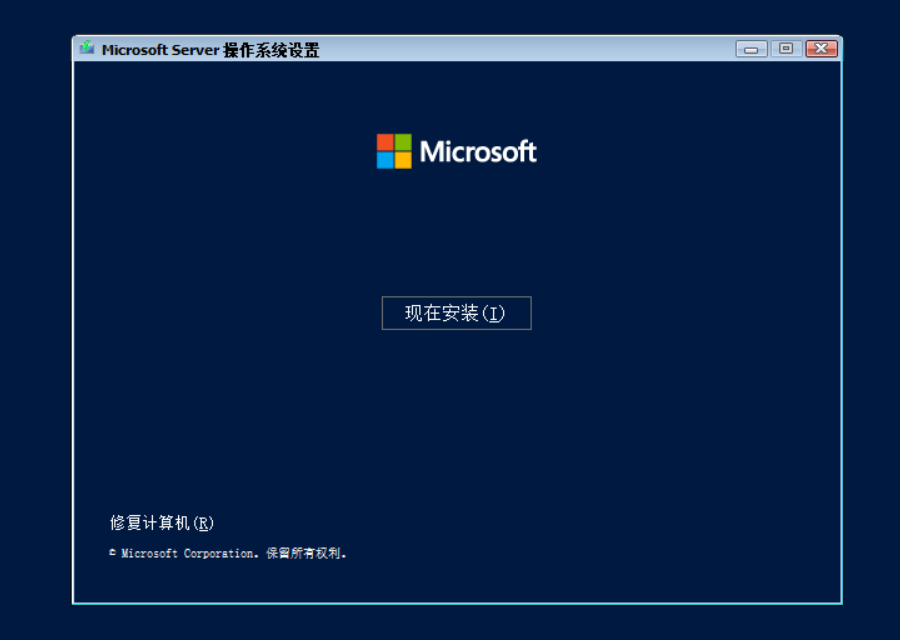


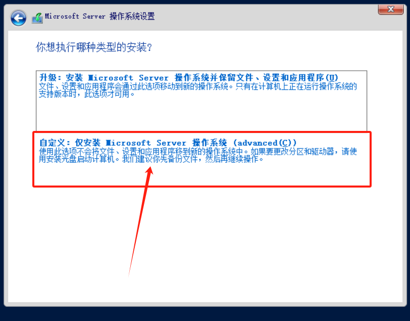


然后如果镜像本身带virtio，那么应该可见可选系统存储的硬盘及其大小，选中后点击```下一页```。


然后等待系统安装，应该会自动重启几次，大概耗时10分钟以上。


安装完成后首次登录会要求设置密码，正常设置即可


设置完成后，NOVNC页面左侧有一个弹出框，点击第一个按钮，然后根据登录提示，点击```Ctrl```+```Alt```+最后一个按钮，进入登录页面。

### 4.初始化网络

由于通过本项目设置的PVE是静态网络，所以登陆后需要手动修改绑定的IP地址，不通过DHCP

在桌面右下角右击点出```打开 网络和Internet设置```，点击后，在弹出的设置页面中点击```更改适配器设置```

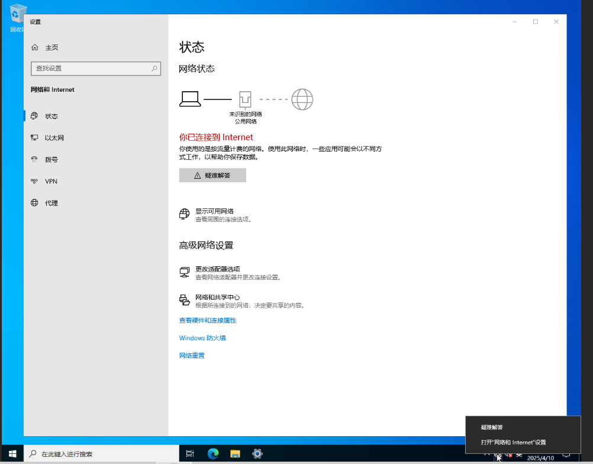

然后在```网络链接```中勾选```以太网```，点击```更改此连接的设置```


在弹出框中点击```Internet协议版本4(TCP/IPV4)```选中后点击```属性```


在新弹出的弹出框中，选择并点击```使用下面的IP地址(s)```，然后分别填入

IP地址(I)：```172.16.1.xxx```(xxx换成你想绑定的ip，我的vmid是100，为了方便写了100)

子网掩码(U)：```255.255.255.0```

默认网关(D)：```172.16.1.1```

然后选择点击```使用下面的DNS服务器地址(E)```，分别填入

```
8.8.8.8
144.144.144.144
```

然后右下角点击确定，注意```不要```勾选```退出时验证```


然后其他弹出框都选```确定```和```是```就行了，然后本虚拟机就有网络了。

## 使用不带virtio的iso镜像开设

无virtio的win镜像下载可使用

<https://down.idc.wiki/ISOS/Windows/>

这块的镜像

virtio的iso镜像可使用

<https://down.idc.wiki/ISOS/Toolkit/>

或者

<https://fedorapeople.org/groups/virt/virtio-win/direct-downloads/archive-virtio/>

下载

virtio也可以只下载msi包，本地用软件打包成iso压缩格式再本地上传到ProxmoxVE中也可以

这样的话包小一些，前者官方的是包含所有WIN镜像支持的包总计500MB左右，后者自己打包5MB左右

### virtio导入

注意这里的导入在ProxmoxVE的8.x及之后的版本中，OS这一栏默认可选择virtio启动加载，如图所示

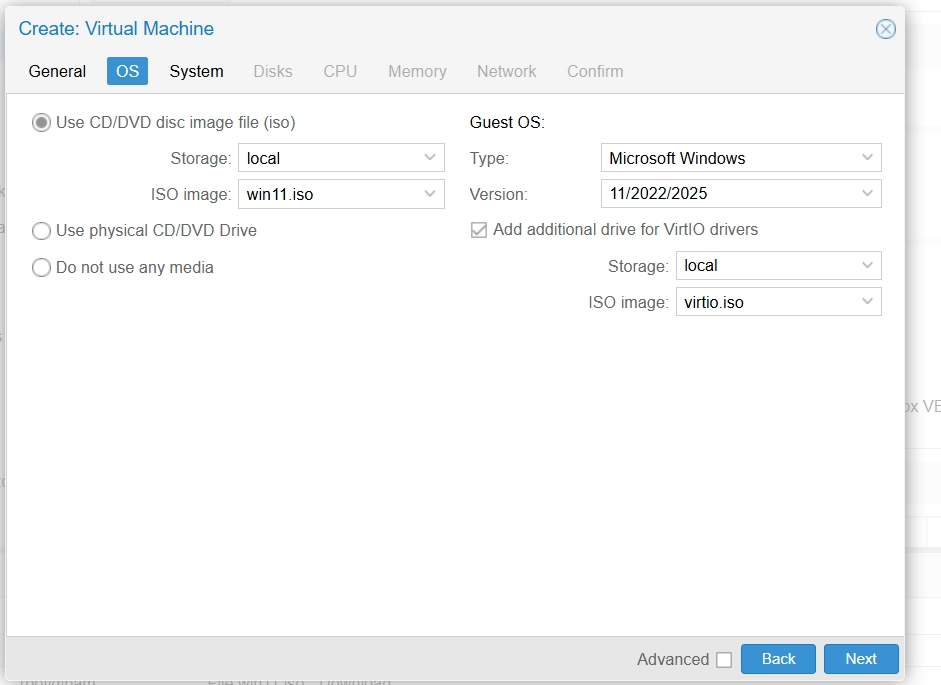

而在更低版本的ProxmoxVE中，比如7.x和6.x的版本，OS这一栏默认无法选择virtio启动加载

需要手动在```Hardware[硬件]```中点击```Add[添加]```添加```CD/DVD Drive```选择下载好的```virtio```的```ISO```文件

![lower][images/lower.png]

然后其他的一切照常，直到


这块找不到硬盘，需要选择```加载驱动程序```

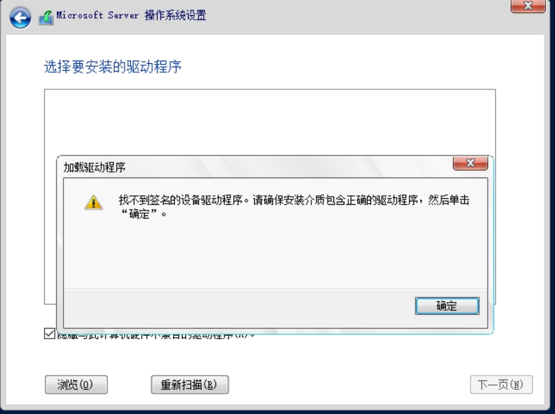

然后选择```驱动盘```是```virtio```的，点击打开，从```amd64```那导入对应系统名字的驱动

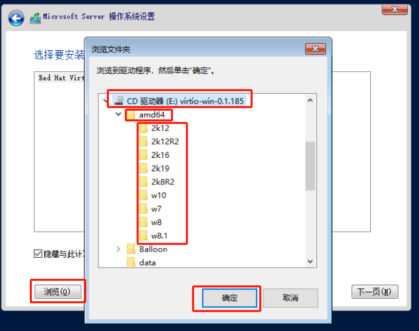

我的是```windows server 2019```的镜像所以导入的是```2k19```的驱动，导入完毕后选择导入的驱动，点击```下一页```

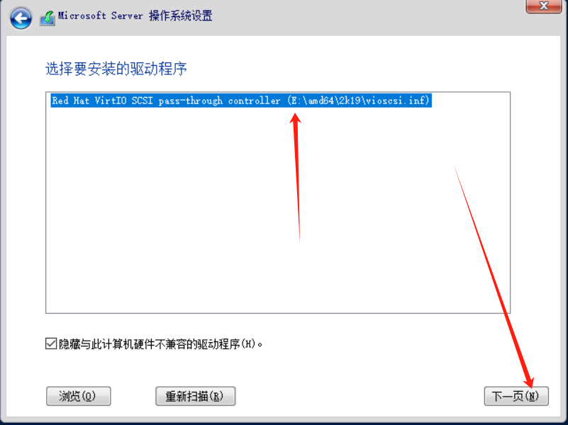


这样就能看得到硬盘了，选中后继续后续的安装步骤，选中后继续后续的安装步骤如同前面的教程，直到系统安装完毕，进入桌面。

### 通过virtio-win-guest-tools安装驱动

此时安装成功，出现桌面后，还需要手动安装驱动

打开```VirtIO```驱动所在的```CD```光驱目录，最下面有一个```virtio-win-guest-tools```程序，会安装用到的virtio驱动，这个驱动也会包含virtio的网卡驱动


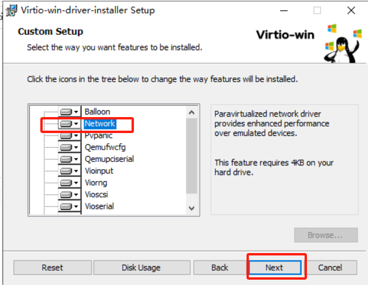

点击安装完毕后也能安装上网卡驱动

### 安装网卡驱动(备选)

此时安装成功，出现桌面后，还需要手动安装网卡驱动才能连通网络：

1. 打开 **控制面板** → **设备管理器**  
2. 找到 **以太网控制器**，右键选择 **更新驱动程序**  
3. 选择 **浏览我的计算机以查找驱动程序软件 (R)**  
4. 浏览到```VirtIO```驱动所在的```CD```光驱目录  
5. 打开其中的 **NetKVM** 文件夹  
6. 根据当前系统版本选择对应的驱动文件夹(和上面相同的操作，我会选择2k19文件夹，里面的amd64驱动)
7. 确认安装，完成后即可成功加载```VirtIO```的网卡驱动


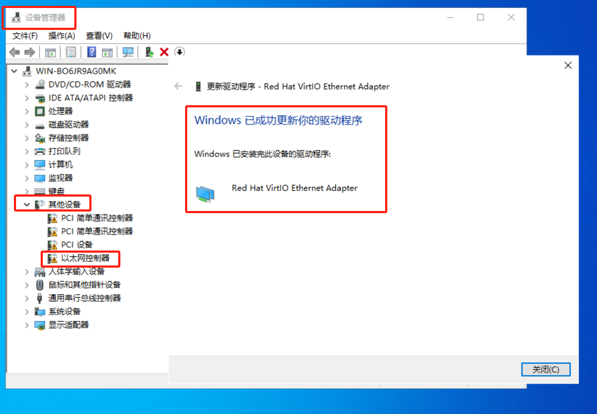


### 取消CD盘挂载

在ProxmoxVE的web端手动在```Hardware[硬件]```中点击对应的```CD```选择```Remove[删除]```然后再重启虚拟机，这样就能直接使用了


